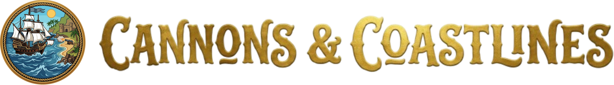

<p align="center">
  
</p>

<p align="center">
  A physical tabletop naval conquest game for 2–20 players.<br>
  No dice. No grid. Just skill.
</p>

---

> **Development Notice:** This game is in early development. Rules, factions, and balance are subject to change. Preview images are concept art and are AI generated.

## About

Cannons & Coastlines is a 3D-printable tabletop game. Ships roll on built-in wheels across any flat surface, cannons actually fire projectiles, and you fight over islands for treasure and territory.

- **Free movement:** no grid, no spaces. Push your ships wherever you want
- **Physical cannons:** 3D-printed snap cannons that shoot across the table
- **Island capture:** plant flags, collect treasure coins, set up gun emplacements
- **Coin economy:** spend treasure for repairs, extra speed, boarding actions, and more
- **2–20 players:** 1v1 duels or massive free-for-alls (30–90 minutes, age 12+)

## Base Game Factions

| Faction | Ships | HP | Cannons | Playstyle |
|---------|-------|----|---------|-----------|
| **Queen's Fleet** | 3 Frigates | 4 | 4 | Well-rounded, 180° pivots |
| **Corsairs** | 4 Sloops | 3 | 3 | Fast raiders, double movement |

Additional factions (Treasure Fleet, Sun Fleet, Shadow Fleet, The Industry, The Islanders) are available as add-ons.

## Downloads

> **Early Development:** All downloads are early development versions only and have a long way to go. Rules, balance, and files are actively changing. Use at your own risk and expect rough edges.

### Rulebook

- [Rulebook (PDF)](rulebook/pdf/rulebook.pdf) | [View as HTML](rulebook/rulebook.html)

### Faction Cards

| Faction | PDF | HTML |
|---------|-----|------|
| Queen's Fleet | [PDF](rulebook/pdf/faction-card-queens-fleet.pdf) | [HTML](rulebook/faction-card-queens-fleet.html) |
| Corsairs | [PDF](rulebook/pdf/faction-card-corsairs.pdf) | [HTML](rulebook/faction-card-corsairs.html) |
| Treasure Fleet | [PDF](rulebook/pdf/faction-card-treasure-fleet.pdf) | [HTML](rulebook/faction-card-treasure-fleet.html) |
| Sun Fleet | [PDF](rulebook/pdf/faction-card-sun-fleet.pdf) | [HTML](rulebook/faction-card-sun-fleet.html) |
| Shadow Fleet | [PDF](rulebook/pdf/faction-card-shadow-fleet.pdf) | [HTML](rulebook/faction-card-shadow-fleet.html) |
| The Industry | [PDF](rulebook/pdf/faction-card-the-industry.pdf) | [HTML](rulebook/faction-card-the-industry.html) |
| The Islanders | [PDF](rulebook/pdf/faction-card-the-islanders.pdf) | [HTML](rulebook/faction-card-the-islanders.html) |

## Repository Contents

```
assets/
├── icons/          # Game action icons (SVG)
├── images/         # Logo and branding
├── playtesting/    # Photos and videos from playtest sessions
└── ships/          # Faction ship preview images
css/                # Website stylesheets
js/                 # Website scripts
index.html          # Game website
```

This repository will eventually contain files for **3D printing** game components (ships, cannons, islands, cannonballs) and **playtesting** materials.

## Community

Join the [Discord community](https://discord.gg/DMuFEWJtZq) to get notified about launches, new files, and playtesting opportunities.

## License

Licensed under [CC BY-NC-SA 4.0](https://creativecommons.org/licenses/by-nc-sa/4.0/).

You are free to share and adapt this material for non-commercial purposes, with attribution, under the same license. See [LICENSE](LICENSE) for details.
